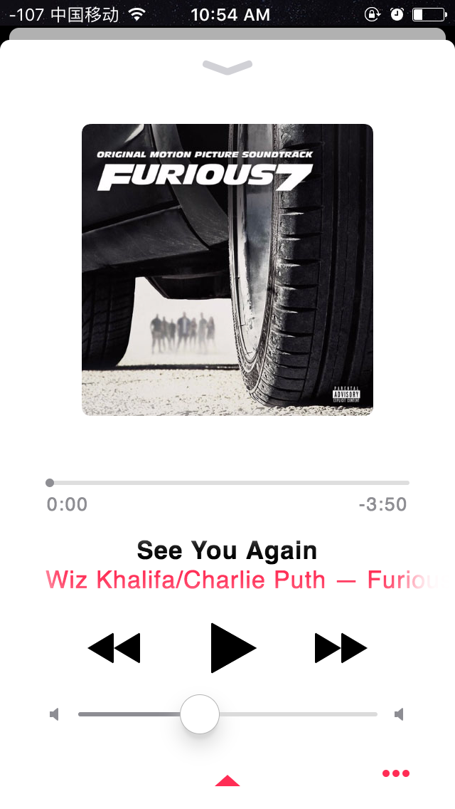
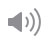

# apple-music

闲来无聊，发现 `Apple Music` 的界面特别好看，于是决定练练自己的动手能力，利用 `HTML5` 和 `CSS3` 来仿写一个。

### 我仿写的界面效果图

> 这是播放时的界面：

> 这是暂停时的界面：

看上去还是有一点点不同的，后期还要进行优化，增加更多的页面，尽量接近原生吧。

### 剩下的工作

* 右边的音量还有 *3* 个波纹

* 最底下的三角形是外放设备选择，同样也有三个波纹

### 总结

* 样式表是用 `SASS` 配合 `Compass` 来书写的，嵌套书写和函数的复用，整个结构比较清楚，也可以减少书写的代码量。

* 导航条和专辑都是用的图片，其他都是用 `CSS` 书写。

* 还增加了一点效果，反复点击播放按键时专辑图片的动效，主要是 `className` 的增加和移除。

* 能用伪类的尽量用伪类，减少 `HTML` 的书写量。