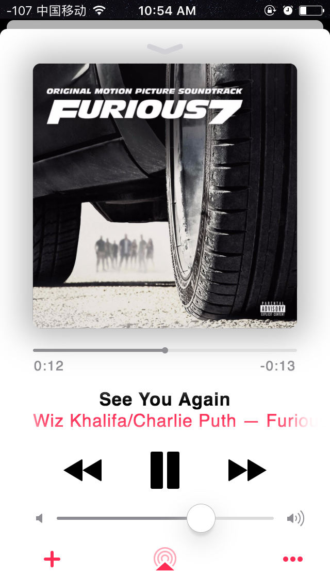

# Apple Music

闲来无聊，发现 `Apple Music` 的界面特别好看，于是决定练练自己的动手能力，利用 `HTML5` 和 `CSS3` 来仿写一个。

### 仿写的界面效果图

> 播放界面：

> 暂停界面：

看上去还是有一点点不同的，特别是专辑图背后的阴影，其实仔细观察后会发现，原生应用中是根据专辑的主色调来显示背后阴影的颜色的，感觉有点难做，当然后期会进行优化，还会增加更多的页面，尽量靠近原生吧。

> 需要在线看效果的小伙伴可以戳[这里](https://chen38.github.io/apple-music/)，然后打开开发者工具，选择手机调试下的 *iPhone 5* 模式，因为我只针对了这个版本。

### ToDoList

- [ ] 进度条、专辑封面和时间显示这三者之间的配合动画

- [ ] 进度条拖拽的一些小 `bug`

- [ ] 当专辑描述过长的时候需要轮播一下，之后又暂停一会儿继续轮播一次，依此类推；但是如果描述没有特别长，可以显示完整，不需要轮播

### 总结

* 样式表是用 `SASS` 配合 `Compass` 来书写的，嵌套书写和函数的复用，整个结构比较清楚，也可以减少书写的代码量。

* 导航条和专辑都是用的图片，其他都是用 `CSS` 书写。

* 点击 `button` 和拖动进度条及音量的动效，主要是 `className` 的增加和移除。

* 整个页面用了很多的伪类 `before` 和 `after`，尽量减少 `HTML` 的书写量。